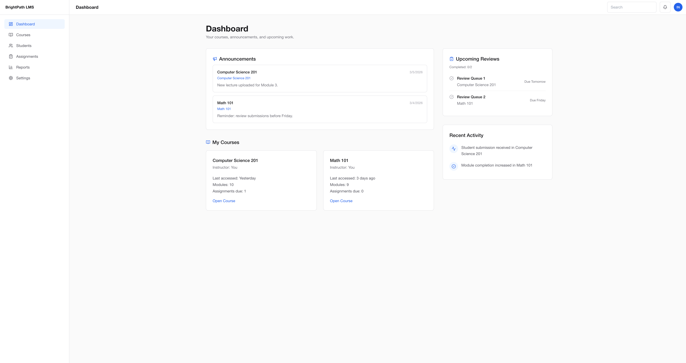
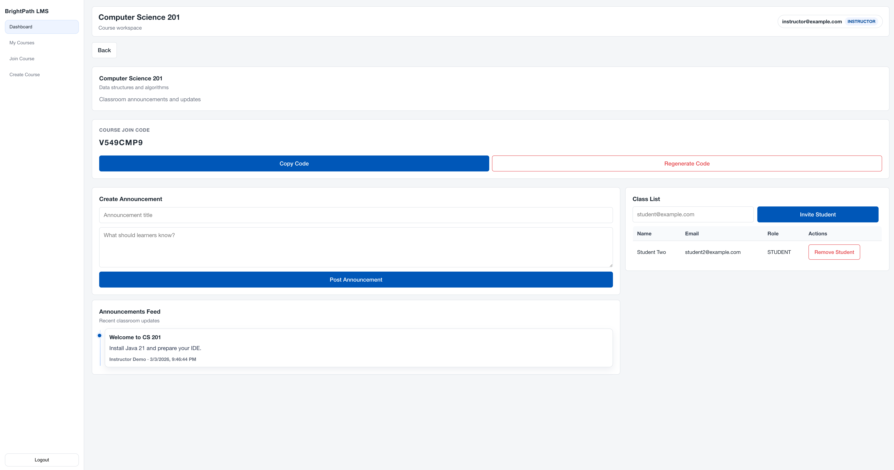
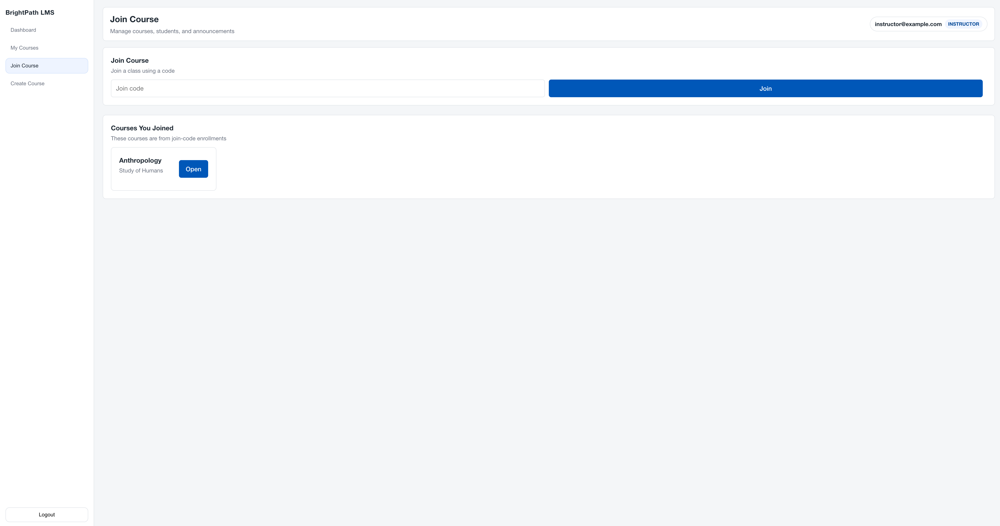

# BrightPath LMS

BrightPath LMS is a full-stack Learning Management System inspired by platforms like D2L. It enables instructors to manage courses and students while giving students a clean experience to join courses and access course content.

## Live Demo

Frontend: [https://brightpath-lms.netlify.app/](https://brightpath-lms.netlify.app/)

Backend API: [https://brightpath-lms.onrender.com](https://brightpath-lms.onrender.com)

## Demo Accounts

### Instructor
- Email: `instructor@brightpath.com`
- Password: `demo123`

### Student
- Email: `student@brightpath.com`
- Password: `demo123`

## Features

- JWT authentication
- Role-based access (Instructor and Student)
- Course management
- Course join code generation and enrollment
- Student enrollment management
- Instructor course dashboard
- Secure protected API endpoints
- Production deployment (Netlify + Render)

## Screenshots

### Dashboard


### Course Page


### Join Course


## Architecture

BrightPath LMS uses a standard production web architecture:

`Netlify (Frontend)` → `Render (Spring Boot API)` → `PostgreSQL`

```text
React + Vite (Netlify)
        |
        | HTTPS REST API
        v
Spring Boot + Security + JWT (Render)
        |
        | JPA / Hibernate
        v
PostgreSQL
```

## Tech Stack

### Frontend
- React
- Vite
- React Router
- Tailwind CSS
- Axios

### Backend
- Java
- Spring Boot
- Spring Security
- JWT Authentication
- Flyway

### Database
- PostgreSQL

### Infrastructure
- Netlify (frontend hosting)
- Render (backend hosting)
- Flyway (database migrations)

## Getting Started

### 1. Clone the repository

```bash
git clone <your-repo-url>
cd D2L
```

### 2. Run backend

```bash
cd backend
mvn spring-boot:run
```

### 3. Run frontend

```bash
cd brightpath-frontend
npm install
npm run dev
```

### 4. Configure environment variables

Create environment files as needed (`.env`, `.env.local`) and set backend secrets before running in non-local environments.

## Environment Variables

Backend requires the following variables:

- `SPRING_DATASOURCE_URL`
- `SPRING_DATASOURCE_USERNAME`
- `SPRING_DATASOURCE_PASSWORD`
- `APP_JWT_SECRET`
- `APP_JOIN_CODE_PEPPER`
- `APP_CORS_ORIGINS`

Example:

```env
SPRING_DATASOURCE_URL=jdbc:postgresql://localhost:5432/brightpath_lms
SPRING_DATASOURCE_USERNAME=your_db_username
SPRING_DATASOURCE_PASSWORD=your_db_password
APP_JWT_SECRET=your_base64_32byte_secret
APP_JOIN_CODE_PEPPER=your_join_code_pepper
APP_CORS_ORIGINS=http://localhost:5173
```

## Database

Database schema changes are managed with Flyway migrations.

Migration location:

```text
backend/src/main/resources/db/migration
```

On backend startup, Flyway applies pending migrations automatically.

## Project Structure

```text
D2L/
├── backend/                  # Spring Boot API
│   └── src/main/java/...    # Controllers, services, security, DTOs
├── brightpath-frontend/     # React + Vite frontend
│   └── src/                 # Pages, components, API client
├── screenshots/             # README screenshots
├── ARCHITECTURE.md
├── DEPLOYMENT.md
└── README.md
```

## Future Improvements

- Assignment creation and submission workflows
- Grading and rubric support
- File upload handling
- Notification system (in-app/email)
- Expanded analytics and reporting

## License

MIT License. See [LICENSE](LICENSE).
