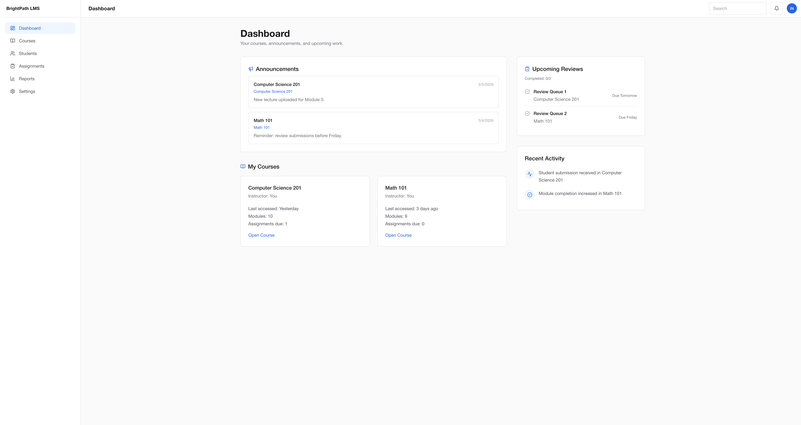
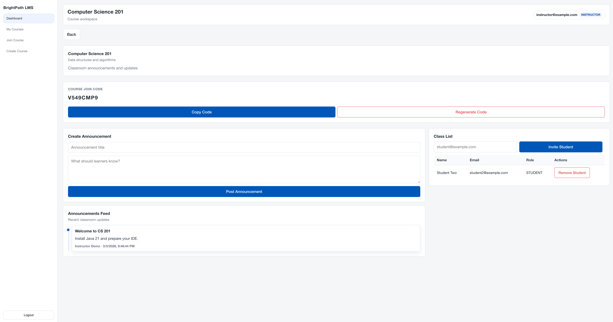
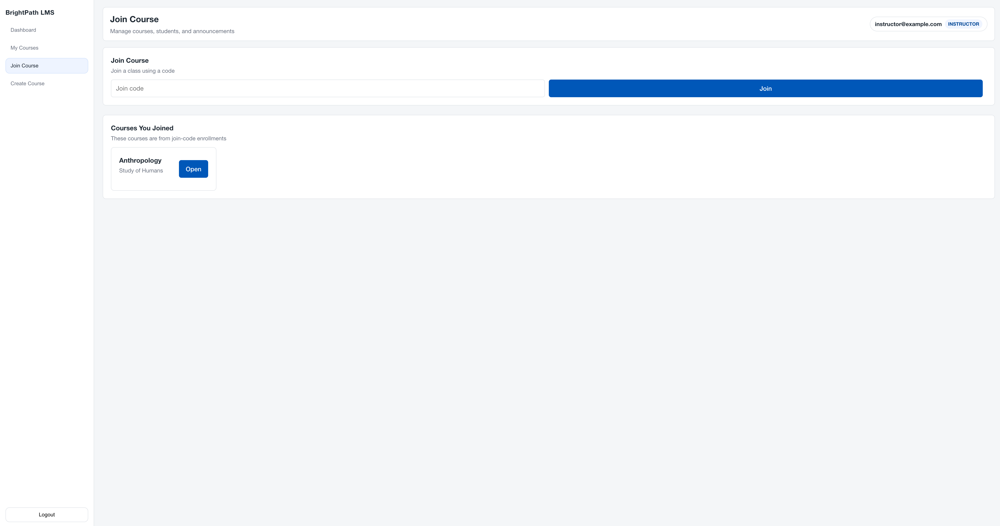

# BrightPath LMS

BrightPath LMS is a full-stack Learning Management System inspired by platforms like D2L. It enables instructors to manage courses and students while giving students a clean experience to join courses and access course content.

## Live Demo

Frontend: [https://brightpath-lms.netlify.app/](https://brightpath-lms.netlify.app/)

Backend API: [https://brightpath-lms.onrender.com](https://brightpath-lms.onrender.com)

## Demo Accounts

### Instructor
- Email: `instructor@brightpath.com`
- Access via the sign-in page demo selector

### Student
- Email: `student1@brightpath.com`
- Access via the sign-in page demo selector

## Features

- JWT authentication
- Role-based access (Instructor and Student)
- Course management
- Course join code generation and enrollment
- Student enrollment management
- Instructor course dashboard
- Instructor-managed course reminders/tasks with per-student completion tracking
- Dashboard search across loaded courses and reminder tasks
- Responsive mobile navigation
- Secure protected API endpoints
- Production deployment (Netlify + Render)

## Screenshots

### Dashboard


### Course Page


### Join Course


## Architecture

BrightPath LMS uses a standard production web architecture:

`Netlify (Frontend)` → `Render (Spring Boot API)` → `PostgreSQL`

```text
React + Vite (Netlify)
        |
        | HTTPS REST API
        v
Spring Boot + Security + JWT (Render)
        |
        | JPA / Hibernate
        v
PostgreSQL
```

### Key Decisions

- The frontend and backend are kept as separate deployable applications, which makes local development and deployment concerns explicit.
- Authentication is stateless with JWT bearer tokens, keeping the API simple and avoiding server-side session management.
- Database schema changes are managed with Flyway so schema evolution is versioned alongside application code.
- Course reminders/tasks are modeled as lightweight course-owned records with separate per-student completion rows, which keeps the feature simple without introducing full LMS submission/grading complexity.

## Tech Stack

### Frontend
- React
- Vite
- React Router
- Tailwind CSS
- Axios

### Backend
- Java
- Spring Boot
- Spring Security
- JWT Authentication
- Flyway

### Database
- PostgreSQL

### Infrastructure
- Netlify (frontend hosting)
- Render (backend hosting)
- Flyway (database migrations)

## Local Setup

### Prerequisites

- Node.js + npm
- Java 21
- Maven

On a fresh macOS machine with Homebrew:

```bash
eval "$(/opt/homebrew/bin/brew shellenv)"
brew install node openjdk@21 maven
```

Set Java 21 for the current terminal session:

```bash
export JAVA_HOME="/opt/homebrew/opt/openjdk@21/libexec/openjdk.jdk/Contents/Home"
export PATH="/opt/homebrew/opt/openjdk@21/bin:$PATH"
```

### 1. Clone the repository

```bash
git clone https://github.com/Muhammad-W-Abbasi/brightpath-lms.git
cd brightpath-lms
```

### 2. Start the backend

```bash
cd backend
SPRING_PROFILES_ACTIVE=dev mvn spring-boot:run
```

The `dev` profile uses an in-memory H2 database and applies Flyway migrations automatically, so PostgreSQL is not required for local development.

### 3. Start the frontend

```bash
cd brightpath-frontend
npm install
cp .env.example .env
npm run dev -- --host 127.0.0.1 --port 5173
```

### 4. Open the app

- Frontend: `http://127.0.0.1:5173`
- Backend health: `http://127.0.0.1:8080/actuator/health`

Use the committed templates at [`brightpath-frontend/.env.example`](brightpath-frontend/.env.example) and [`backend/.env.example`](backend/.env.example) for local environment configuration.

For a role-by-role walkthrough, see [`docs/demo-guide.md`](docs/demo-guide.md).

## Environment Variables

Frontend:

- `VITE_API_BASE_URL`

The committed default in [`brightpath-frontend/.env.example`](brightpath-frontend/.env.example) points to the local backend:

```bash
VITE_API_BASE_URL=http://localhost:8080/api
```

Backend production configuration:

- `SPRING_DATASOURCE_URL`
- `SPRING_DATASOURCE_USERNAME`
- `SPRING_DATASOURCE_PASSWORD`
- `APP_JWT_SECRET`
- `APP_JOIN_CODE_PEPPER`
- `APP_CORS_ORIGINS`

For local development with `SPRING_PROFILES_ACTIVE=dev`, the backend has safe defaults and does not require PostgreSQL credentials.

## Database

Database schema changes are managed with Flyway migrations.

Migration location:

```text
backend/src/main/resources/db/migration
```

On backend startup, Flyway applies pending migrations automatically.

The local demo seed includes `Modern Web Development Foundations`, announcements, enrolled demo students, and reminder tasks.

## Verification

Frontend:

```bash
cd brightpath-frontend
npm run build
npm run lint
npm run typecheck
npm audit --audit-level=high
```

Backend:

```bash
cd backend
mvn test
mvn package
```

## Project Structure

```text
brightpath-lms/
├── backend/                 # Spring Boot API
│   └── src/main/java/...    # Controllers, services, security, DTOs
├── brightpath-frontend/     # React + Vite frontend
│   └── src/                 # Pages, components, API client
├── screenshots/             # README screenshots
├── ARCHITECTURE.md
├── DEPLOYMENT.md
└── README.md
```

## Future Improvements

- Automated tests for course task/reminder flows
- Replace remaining demo dashboard placeholders with live activity data
- Deployment docs for the latest reminder/task feature
- File upload handling
- Notification system (in-app/email)
- Expanded analytics and reporting

## License

MIT License. See [LICENSE](LICENSE).
